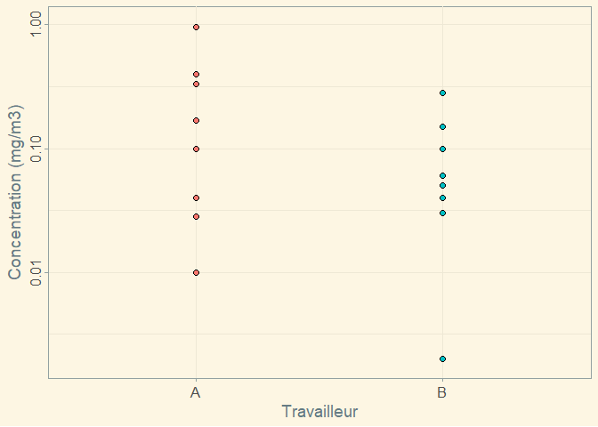
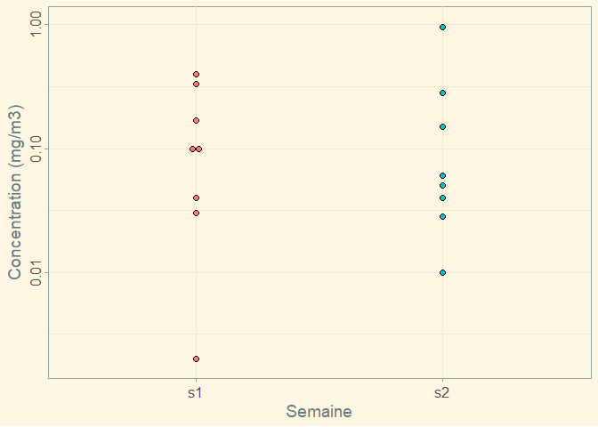
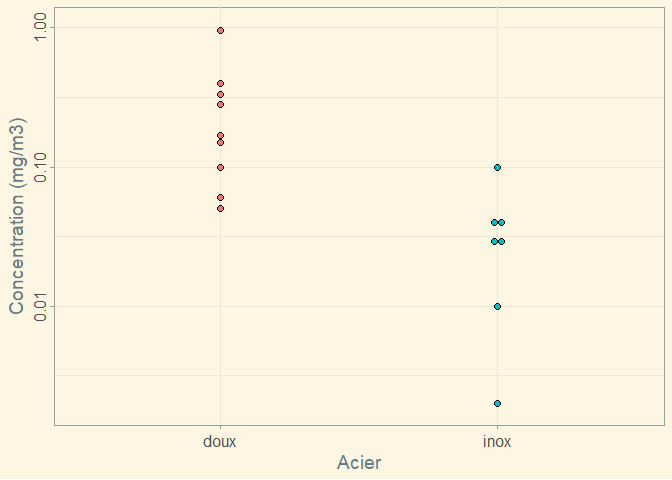

dotplot_manganese
================
Jérôme Lavoué
Dec 13, 2022

figure 1 - graphique en points avec médiane pour les travailleurs

``` r
p <- ggplot(data = manganese) + geom_dotplot(aes(y = vemp8h , x = travailleur, fill = travailleur),
                                       binaxis = "y",         # which axis to bin along
                                       binwidth = 0.05,        # Minimal difference considered diffeerent
                                       stackdir = "center"    # Centered
                          )


p <- p + theme_solarized()

p <- p +  xlab('Travailleur')+
  ylab("Concentration (mg/m3)")+
  theme(axis.title.x=element_text(size=14))+
  theme(axis.title.y=element_text(size=14,angle=90))+
  theme(axis.text.x=element_text(size=12 , hjust = 0.5))+
  theme(axis.text.y=element_text(size=12 , angle=90 ,  hjust = 0.5))+
  theme(legend.position="none")

p <- p + scale_y_log10()

p
```

<!-- -->

figure 2 - graphique en points avec médiane pour les semaines

``` r
p <- ggplot(data = manganese) + geom_dotplot(aes(y = vemp8h , x = semaine, fill = semaine),
                                             binaxis = "y",         # which axis to bin along
                                             binwidth = 0.05,        # Minimal difference considered diffeerent
                                             stackdir = "center"    # Centered
)


p <- p + theme_solarized()

p <- p +  xlab('Semaine')+
  ylab("Concentration (mg/m3)")+
  theme(axis.title.x=element_text(size=14))+
  theme(axis.title.y=element_text(size=14,angle=90))+
  theme(axis.text.x=element_text(size=12 , hjust = 0.5))+
  theme(axis.text.y=element_text(size=12 , angle=90 ,  hjust = 0.5))+
  theme(legend.position="none")

p <- p + scale_y_log10()

p
```

<!-- -->

figure 2 - graphique en points avec médiane pour les aciers

``` r
p <- ggplot(data = manganese) + geom_dotplot(aes(y = vemp8h , x = acier, fill = acier),
                                             binaxis = "y",         # which axis to bin along
                                             binwidth = 0.05,        # Minimal difference considered diffeerent
                                             stackdir = "center"    # Centered
)


p <- p + theme_solarized()

p <- p +  xlab('Acier')+
  ylab("Concentration (mg/m3)")+
  theme(axis.title.x=element_text(size=14))+
  theme(axis.title.y=element_text(size=14,angle=90))+
  theme(axis.text.x=element_text(size=12 , hjust = 0.5))+
  theme(axis.text.y=element_text(size=12 , angle=90 ,  hjust = 0.5))+
  theme(legend.position="none")

p <- p + scale_y_log10()

p
```

<!-- -->
